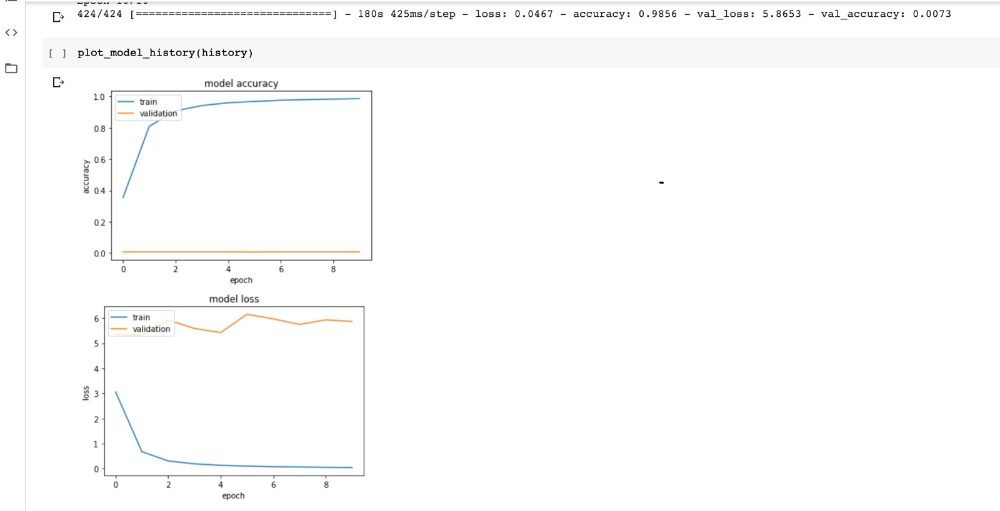

# Image Classification

### Projektbeschreibung

Bei diesem Projekt geht es darum mit dem Datensatz "Fruits-360" (bei Kaggle zu finden) den Einfluss von Hyperparametern auf ein Model darzustellen.
Dafür wurde als Lösungsansatz "Transfer Learning" ausgewählt. Es wird später mehr darauf eingegangen. 

### Fruits-360

	

[fruits-360](https://www.kaggle.com/moltean/fruits)

Dieser Datensatz besteht aus 90483 Obst-Bilder, die in 131 Klassen (Avocado, Apfel, Kirschen etc.) unterteilt sind. Diese ganze Bilder würden in 3 Verzeichnisse verteilt, das erste enthält Bilder für das Training (67692 Bilder), das nächste enthält Bilder für das Testen (22688) und das letzte 103 Bilder auf denen mehreren Obst zu sehen sind. Das letztere Verzeichnis wird jedoch während dieser Arbeit nicht verwendet. Die Bilder haben eine Größe von 100x100 Pixel und der Datensatz wurde für das letzte Mal am 18. Mai 2020 aktualisiert. 

### Ähnliche Arbeiten 

Es gibt auf Kaggle eine Menge Arbeiten, die auf diesem Datensatz basiert und es wurde schon eine Genauigkeit von 98% erreicht. Aus diesem Grund ist der Fokus dieser Arbeit nicht eine bessere Accuracy zu erreichen sondern Model zu trainieren mit unterschiedlichen Parametern und zu beobachten wie die ausgewählte Parameter auf das Ergebnis einwirken und falls ungewollte Fehler auftreten, diese zu korrigieren.

### Transfer Learning 

Bei **Transfer Learning** wird ein schon trainiertes Model für eine spezifische Tätigkeit verwendet und dieses auf eine ähnliche Tätigkeit angewendet.
Diese Optimierung ermöglicht es bei der neuen Tätigkeit eine schnelle Lösung und öfter eine bessere Lösung für erreichen.
Diese Methode basiert auf 3 Schritte when man ein schon trainiertes Model weiterverwenden will: 
  - Base Model auswählen: ein schon trainiertes Model soll ausgewhählt werden, am bestens ein Model, das schon mit ähnlichen Daten wie die neuen Daten trainiert         wurde. 
  - Wiederverwendung des ausgewählten Model: das ausgewählte Model kann dann für die neue Tätigekeit eingesetzt werden. Bei dem Einsatz kann das ganze Model ohne 
    weitere Änderung oder mit Änderungen verwendet werden.
  - Bei dem letzten Schritt geht es darum, das mödel zu verbessern, um ein besseres Ergebnis zu erreichen. 

Transfer Learning ist nützlich wenn der Entwickler Zeit sparen möchte, nicht genug Daten hat und eine bessere Perfotmanz erzielen möchte. 

### ResNet50 

Da Transfer learning als Lösungsansatz ausgewählt wurde, wird ResNet50 als Base-Model für diese Arbeit eingesetzt.

ResNet50 ist eine CNN bestehend aus 50 Layers. Das Frameworks keras stellt ein schon trainiertes Model von ResNet50 zur Verfügung, dieses Model wurde mit dem Datensatz **ImageNet** trainiert. Dieses erzielte eine Top-1 Genauigkeit von 75% und eine Top-5 Genauigkeit von 92%.

### Implementierung

Es wurden insgesamt 6 Modele basierend auf ResNet50 trainiert, die Modele wurden nach und nach verbessert, um bessere Ergebnisse zu erzielen in dem Hyperparameter immer angepasst wurden. Die Plot von allen trainierten Modellen werden hier dargestellt und erklärt.
Zu allen Modelen wurden vie neue Layers hinzugefügt:
- Zwei Dense Layer, mit "relu" als Aktivierungsfunktion, einmal 512 und 256 Units für die Dimension des Outputs 
- zwischen diesen Dense() Layers sind Dropout() Layers mit einer Rate von 25%
- Der Output Layer ist ebensfalls ein Dense() mit "softmax" als Aktivierungsfunktion und 131 Units, weil die Datensätze über 131 Klassen verfügt. Softmax ist immer
  Softmax ist die Funktion, die am bestens passt für eine Klassifiezierung von mehr als 2 Klassen.
  
## Model 1

Beim ersten Training wurde das ResNet50 Model geladen, der letzte Layers deaktiviert "freeze" und die anderen Layers des Models so gesetzt, dass diese nicht trainiert werden. 

Das Ergebnis des ersten Trainings ist im unten stehenden Bild zu sehen. 

	

Wie auf dem Bild zu sehen ist, hat das Model nicht wirklich gelernt, weil die Accuracy für die Validation Bilder nicht mal 1% erreicht hat. Das erste Model wird mit den Testbildern evaluiert und ergibt eine Genauigkeit von 0,71%. Von den 22688 Testbildern können nur 163 Bilder richtig erkannt werden. (very bad result 😢 )

## Model 2

Hier ging es darum alle Layers von ResNet50 10 Epochen zu trainieren.

	

Wie dem Bild zu entnehmen ist, konnte hier ein besseres Ergebnis erreicht werden. Jedoch merkt man das es zwischen den Epochen [2 4] und [6 9] zu eineim möglichen Overfitting kommt, weil in diesen Bereichen die Loss größer wird. 
Beim nächsten Ansatz wird versucht das Problem zu lösen. 

## Model 3

Das Problem des Overfittings, das taucht beim zweiten Model wollen wir hier lösen. Das Problem taucht auf wenn das trainierte Model eine schlechte Genauigkeit ergibt mit neuen Datensätze, einfach erklärt: training loss << validation loss. 

Es gibt mehrere Methoden das Overfitting zu vermeiden (hier werden nur 2 zwei einfachsten erwähnt)
- Das Model mit mehr Daten trainieren
- Early stopping: hier geht es darum das Model mit weningen Epochen zu trainieren. Bis zu einem bestimmten Punkt wird das Model verbessert, Nach diesem Punkt kann     die Fähigkeit des Modells zur Verallgemeinerung jedoch nachlassen, wenn es beginnt, die Trainingsdaten zu überlagern. Die Idee ist dann das Model nur bis zu diesem Punkt zu trainieren. 

	

    
